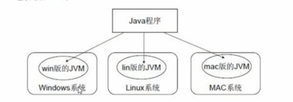

## 一、基础知识

### 1-1 计算机组成


+ 硬件

  硬件包含：输入设备、输出设备、存储设备、CPU、其他设备。

  输入设备中常见的：鼠标、键盘、麦克风...

  输出设备常见的：显示器、音响、打印机...

  存储设备常见的：硬盘、内存条、U盘、光盘...

  CPU(中央处理器)包含两部分：运算器、控制器...

  其他设备有：机箱、

+ 软件

  软件又分为：系统软件、应用软件

  系统软件常见的：Win7、win8、win10、Linux、Mac

  应用软件常见的：电脑上的软件

  应用软件包含两种结构：

  ​	C/S(Client/Server)：客户端/服务器

  ​	先下载，然后再安装，最后才可以使用

  

  B/S(Browser/Server):浏览器/服务器


### 1-2 存储单位

计算机中存储二进制信息，也就是0和1，而日常生活中使用十进制。

8bit -----------------> 1byte

1024byte ---------> 1KB

1024KB------------->1MB

1024MB ------------>1GB

1024GB ------------->1TB


### 1-3 常见的DOS命令

1.命令

2.如何打开DOS窗口？

```js
1.在开始菜单找
2.按住shift右键打开
3.在文件管理上面的文件里面输入 cmd 回车
4.win+R 输入cmd
```

3.路径（不做过多解释了）

+ 绝对路径
+ 相对路径

4.常见DOS命令

```html
dir 查看某一个路径下所有的文件

cd 在同一个盘符下面切换目录
	相对路径或者绝对路径
cd .. 返回上一级目录
cd / 返回当前根目录
D: 更改盘符
cls 清屏
exit 退出、关闭
```


### 1-4 计算机语言发展史

计算机语言：人与计算机交互所使用的语言。

发展史

第一代：机器语言

​	编写二进制，以打孔机为代表

第二代：低级语言

​	出现少量单词

第三代：高级语言

​	如Java、C、C++......


### 1-5 Java语言发展史

在1995年诞生的，当时SUM公司（太阳微电子公司），后来被Oracle（甲骨文）公司收购了。

派James Gosling领导团队开发了一款语言，Oak语言（橡树语言）

Oak语言改名为Java语言。


Java之父？James Gosling

发展史？

​	在1996年发布JDK1.0

​	JDK：Java开发工具包，也就是说如果想开发Java程序必须安装JDK。

​	...

​	最新版本 JDK10.0

​	目前所使用JDK8.0


Java语言包含三大块：

​	J2SE：平台标准版，可以做桌面程序开发

​		它是整个Java技术的基础和核心

​	J2EE：平台企业版，可以做网站。

​	J2ME：平台微型版，可以做移动端程序开发。

注意：在JDK5.0时改名了JAVASE、JAVAEE、JAVAME


### 1-6 Java语言特性

+ **简单性**：Java舍弃了C++中难以掌握并不安全的功能，如：指针，多继承等。

  Java语言底层是C++实现的

+ **面向对象**：Java和C++一样，是一种面向对象语言。

+ **安全性**：如：运行时堆栈溢出，强制类型检查。

+ **健壮性**：Java语言在运行过程中产生的垃圾会自动回收，简称GC机制。

+ **可移植性**：Java程序编译一次，不做任何修改时到处运行，也就是跨平台。

  在不同平台上安装不同JVM

+ ......


### 1-7 Java的加载与执行

```js

Java源代码 --> 编译 --> Java字节码（可跨平台） --> 运行 --> JVM Java虚拟机 ---（windows/ Linux / / Mac）

```

  

注意：JVM本身并不具备跨平台功能，每个操作系统都有不同版本的虚拟机。


+ **第一步：编写Java源代码**，注意：后缀名是.java 如 Hello.java

+ **第二步：编译**   也就是检查Java语法格式。

  使用javac 命令编译java源文件 如：javac Hello.java

  当编译成功时，则自动生成一个字节码文件(.class)，如 Hello.class

  当编译失败时，则改错然后重新编译。

+ **第三步：运行** 注意：运行的是字节码文件

  注意：如果想要在当前操作系统上运行字节码文件，则必须保证有JVM

  JVM：Java虚拟机，不能单独安装

  解决办法：

  ​	1.在安装JDK的同时安装JVM

  ​	2.在安装JRE的同时安装JVM


JDK、JRE、JVM各自是什么，以及之间的关系?

​	JDK：Java开发工具包

​	JRE：Java运行环境

​	JVM：Java虚拟机 （不能单独安装的）

我们想要运行一个已有的Java程序，那么只需要安装`JRE`即可

我们想要开发一个全新的Java程序，那么必须安装`JDK`。

  


## 二、java

### 2-1 编写第一个java程序

+ 第一步：编写Java程序

```java
class Hello{
	public static void main(String[] args){
		System.out.print("Hello World");
	}
}
```

+ 第二步：编译

  javac Hello.java

```js
javac 不是内部命令，也不是可运行的程序或批处理文件
```


### 2-2 下载JDK与配置环境变量

当编译后出现以上问题时，解决办法：

​	安装JDK以及配置环境变量。

​	配置环境变量

注意：当环境变量配置成功后，则必须将之前的DOS命令窗口关闭。

```html
安装的时候，那三个可以把最后一个jre去掉，因为jdk已经包含了jre和jvm
或者安装一个之后再下一步的过程中直接取消。
```

```js
javac Hello.java  运行dos命令
java Hello 运行出结果
```


### 2-3 Java源文件组成部分


第一部分：编写类也叫做外部结构。

```java
class Student{
    
}
```


第二部分：**编写main方法，也叫做主方法或程序入口。**

​	注意：1.编写在类中

​				2.在一个类中的main方法是可有可无的。

​				3.如果编写main方法，则在一个类中最多有一个

```js
class Student{
    public static void main(String[] argus){
        
    }
}
```

第三部分：编写代码

​	注意：1.暂时将代码编写在入口中

​				2.可以在入口中编译 N 条语句，语句也就是以英文分号作为结束。


### 2-4 输出语句

```js
System.out.print("编写大小写字母，汉字、数字以及特殊符号，但是输出之后不换行，");
System.out.println("输出内容同上，但是输出后换行");
```


### 2-5 注释

​	作用：解释说明，在程序中并不运行。

​	目的：增加程序可读性。

​	注释分类：

```java
单行注释：// 
多行注释： /*    注释内容  */

文档注释
    /**
    	注释内容
    	*/
```


### 2-6 public class 与 class区别

+ 一个类前面的 public 是可有可无的
+ 如果一个类使用 public 修饰，则文件名必须与类名一致。
+ 一个类前面如果没有public修饰，则文件名可以与类名不一致，**当编译成功后会生成对应类名的字节码文件**。
+ 一个类中的main方法是可有可无的，如果没有编写main方法，编译成功，但是不能运行。
+ 在一个源文件中可以编写任意多个类，当编译成功后，会自动生成类的个数的字节码文件，并可以运行每个字节码文件(必须保证有入口)。


