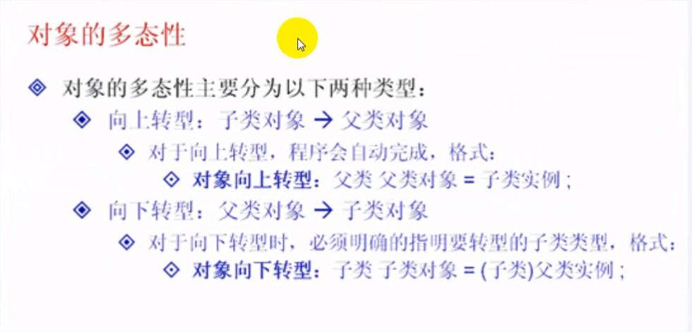

## 多态性


#### 1-1多态性的概念


#### 1-2对象的多态性实现




#### 1-3对象的向上转型

```java
语法格式

父类 父类对象 = 子类实例;
```

是通过子类进行父类的对象的实例化操作的，

**如果调用方法被子类重写过，则肯定调用被重写过的方法。**

**转型之后，因为操作的是父类的对象，所以是无法找到在子类中定义的新方法**。


**例1、子类重写父类方法**

```java
class GG{ // 定义类GG
	public void fun1() {
		System.out.println("GG--> public void fun1(){}");
	}
	public void fun2() {
		this.fun1(); // 调用fun方法
	}
}

class FF extends GG{
	public void fun1() { // 此方法被子类重写
		System.out.println("FF--> public void fun1(){}");
	}
	public void fun3() {
		System.out.println("FF--> public void fun3(){}");
	}
}

public class Demo01 {
	public static void main(String[] args) {
		FF f = new FF(); // 实例化子类对象
		GG g = f; // 向上转型
		g.fun1(); // 此方法被子类重写了
		g.fun2();
	}
}

//-----------运行结果----------------
FF--> public void fun1(){}
FF--> public void fun1(){}
//-----------运行结果----------------
```


**例2**

```java
class GG{ // 定义类GG
	public void fun1() {
		System.out.println("GG--> public void fun1(){}");
	}
	public void fun2() {
		this.fun1(); // 调用fun方法
	}
}

class FF extends GG{
//	public void fun1() {
//		System.out.println("FF--> public void fun1(){}");
//	}
	public void fun3() {
		System.out.println("FF--> public void fun3(){}");
	}
}

public class Demo01 {
	public static void main(String[] args) {
		FF f = new FF(); // 实例化子类对象
		GG g = f; // 向上转型
		g.fun1(); // 此方法被子类重写了
		g.fun2();
	}
}

//-----------运行结果----------------
GG--> public void fun1(){}
GG--> public void fun1(){}
//-----------运行结果----------------
```


#### 1-4对象的向下转型

将父类的对象变为子类对象，称为向下转型，向下转型需要采用强制的手段。


**例子1、对象向下转型**

在m中存在3个方法，所以都可以调用

但是在进行对象向下转型的时候有一个注意点：


```java
class GG{ // 定义类GG
	public void fun1() {
		System.out.println("GG--> public void fun1(){}");
	}
	public void fun2() {
		this.fun1(); // 调用fun方法
	}
}

class FF extends GG{
	public void fun1() { // 此方法被子类重写
		System.out.println("FF--> public void fun1(){}");
	}
	public void fun3() {
		System.out.println("FF--> public void fun3(){}");
	}
}

public class Demo01 {
	public static void main(String[] args) {
		GG g = new FF(); // 向上转型
		FF m = (FF)g; // 发生向下转型关系
		
		m.fun1();
		m.fun2();
		m.fun3();
	}
}

// 在m中存在3个方法，所以都可以调用

//-----------运行结果----------------
FF--> public void fun1(){}
FF--> public void fun1(){}
FF--> public void fun3(){}
//-----------运行结果----------------
```


