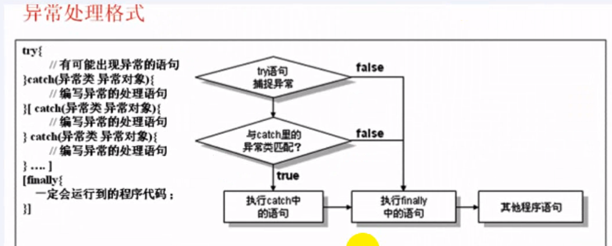
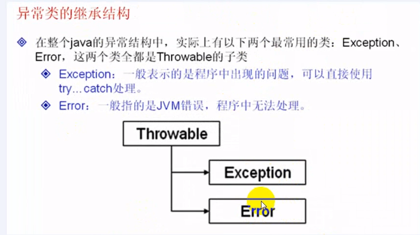
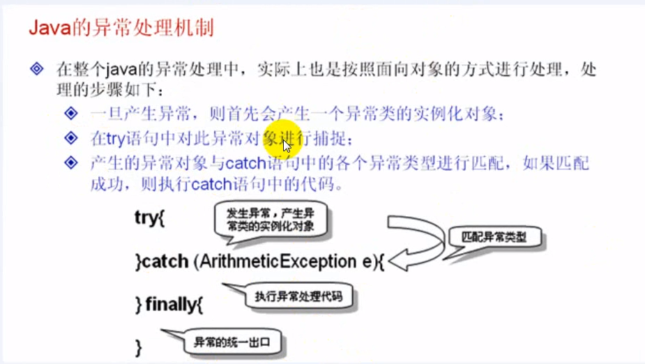

## 异常

#### 1-1了解异常的基本概念


异常的两大杀手

​	1、断电

​	2、被除数为0

```java
public class ExceptionDemo01 {
	public static void main(String[] args) {
		System.out.println("****计算开始******");
		int i = 10;
		int j = 0;
		int temp = i/j; // 计算结果 ，在这里除数为0时报错
		System.out.println("两个数字相除的结果" + temp);
		System.out.println("****计算结束******");
	}
}

//---------运行结果---------------
****计算开始******
Exception in thread "main" java.lang.ArithmeticException: / by zero
	at com.day14.ExceptionDemo01.main(ExceptionDemo01.java:8)
//---------运行结果---------------
```


#### 1-2掌握异常的基本处理格式


`try` 中捕获异常，出现异常之后的代码将不再执行，而是跳转到 `catch` 语句中执行，用于处理异常。





```java
public class ExceptionDemo01 {
	public static void main(String[] args) {
		System.out.println("****计算开始******");
		int i = 10;
		int j = 1;
		try {
			int temp = i/j;	
			System.out.println("两个数字相除的结果" + temp);
		}catch (Exception e) {
			// TODO: handle exception
			System.out.println("出现异常");
			System.out.println(e);
		}finally { // 作为异常的统一出口
			System.out.println("不管是否出现异常，都执行final代码");
		}
		
		System.out.println("****计算结束******");
	}
}
```


**用户输入参数**

如果没有输入参数、输入不是数字或者输入的参数不够，则会出现问题。

1、数组越界异常

2、数字格式化异常

3、算术异常

```java
public class ExceptionDemo01 {
	public static void main(String[] args) {
		System.out.println("****计算开始******");
		int i = 10;
		int j = 1;
		try {
			String str1 = args[0]; // 接收第1个参数
			String str2 = args[1]; // 接收第2个参数
			i = Integer.parseInt(str1);
			j = Integer.parseInt(str2);
			
			int temp = i/j;	
			System.out.println("两个数字相除的结果" + temp);
		}catch (ArithmeticException e) {
			// TODO: handle exception
			System.out.println("出现异常" + e);
		}
		System.out.println("****计算结束******");
	}
}
```


1、数组越界异常

2、数字格式化异常

3、算术异常

我们现在就只知道了这几种异常情况，可能还会有其他的异常，可以把知道的捕获起来，把不知道的异常也捕获起来。


```java
public class ExceptionDemo01 {
	public static void main(String[] args) {
		System.out.println("****计算开始******");
		int i = 10;
		int j = 1;
		try {
			String str1 = args[0];
			String str2 = args[1];
			i = Integer.parseInt(str1);
			j = Integer.parseInt(str2);
			
			int temp = i/j;	
			System.out.println("两个数字相除的结果" + temp);
		}catch (ArithmeticException e) {
			System.out.println("出现异常==> 除数不能为0" + e);
		}catch(NumberFormatException e){
			System.out.println("数字转换异常==>" + e);
		}catch(ArrayIndexOutOfBoundsException e){
			System.out.println("数组下标越界，传入正确个数的参数" + e);
		}
		System.out.println("计算结束");
	}
}
```


#### 1-3掌握异常的继承结构




**注意：**

一般在输出异常信息的时候，可以使用 `System.out.println()` 打印出异常对象。

也可以通过 `Exception` 

```java
e.printStackTrace();
```


#### 1-4掌握java的异常处理机制


**注意：**在异常处理中，捕获更粗的异常放在捕获更细的异常之前。





问题：既然用到了捕获 `Exception` 是最方便的，那么直接捕获  `Throwable` 可以不可以？


#### 总结

异常出现之后如果没有合格处理的话，则会让整个程序中断执行。

使用 `try ... catch` 和 `try ... finally{}` 可以处理异常，`finally` 将作为异常的统一出口，不管是否有异常都会执行此语句。

一个异常中可以同时出现多个 `catch` ，但是捕获更粗异常要放在捕获更细的异常之后，否则程序编译将出现错误。

在异常中最大类是 `Throwable` ，分为两个子类：`Exception` 和 `Error`

​	`Exception` 是程序可以自己处理的异常

​	`Error` 表示 jvm 错误，一般程序是无法处理的

捕获的时候可以直接捕获 `Exception` ，但是最好分开捕获，如果所有的异常处理操作时一样的话，则也可以直接捕获 `Exception`

每当异常产生之后，会在程序中产生一个异常类的实例化对象，之后使用此对象与 `catch` 中的异常类型项匹配，如果匹配成功，则执行 `catch` 语句中的内容。如果匹配不成功，则向下继续匹配。如果都无法成功，程序出现中断执行的问题。


## throw

#### 2-1 throws

掌握 `throws`与`throw` 关键字的作用


**例子1、throws抛出异常**

```java
/**
 * div使用了throws关键字进行声明，所以在调用此方法的时候，方法必须进行异常处理
 * 
 */

class Math{
	// 除法操作，如果有异常，则交给被调用处处理
	public int div(int a,int b) throws Exception {
		int temp = a/b; // 计算，此处有可能出现异常
		return temp;
	}
}

public class ThrowDemo01 {
	public static void main(String[] args) {
		Math m = new Math(); // 实例化Math对象
		try {
			System.out.println("除法操作" + m.div(10, 0));
		}catch (Exception e) {
			e.printStackTrace();
		}
	}
}
```


**例子2、**

```java
class Math{
	// 除法操作，如果有异常，则交给被调用处处理
	public int div(int a,int b) throws Exception {
		int temp = a/b; // 计算，此处有可能出现异常
		return temp;
	}
}

public class ThrowDemo01 {
	// 在主方法中所有异常都可以不使用  try...catch进行处理
	public static void main(String[] args)throws Exception {
		Math m = new Math(); // 实例化Math对象
		System.out.println("除法操作" + m.div(10, 2));
	}
}
```


#### 2-2 throw


**例子，自己抛出一个错误**

```java
public class ThrowDemo01 {
	public static void main(String[] args) {
		try {
			throw new Exception("自己抛着玩的"); // 抛出异常的实例化对象
		}catch (Exception e) {
			// TODO: handle exception
			System.out.println("异常处理" + e);
		}
	}
}
```


**除法操作**

```java
class Math{
	// 除法操作，如果有异常，则交给被调用处处理
	public int div(int a,int b) throws Exception {
		System.out.println("**计算开始--");
		int temp = 0;
		try {
			temp = a/b; // 计算，此处有可能出现异常
		}catch(Exception e) {
			throw e;
		}finally { // 不管是否有异常，都执行统一的入口
			System.out.println("--计算结束--");
		}
		return temp;
	}
}

public class ThrowDemo01 {
	public static void main(String[] args) {
		Math m = new Math();
		try {
			System.out.println("触发操作" + m.div(10, 0));
		}catch (Exception e) {
			// TODO: handle exception
			System.out.println("异常处理" + e);
		}
	}
}

```


掌握 `Exception` 与 `RuntimeException`的区别

可以自定义异常类


