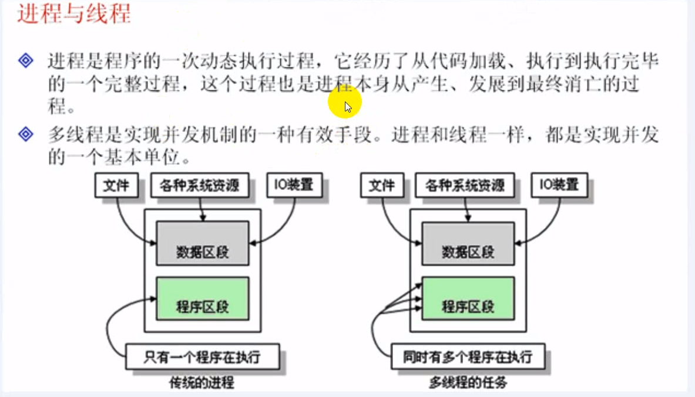
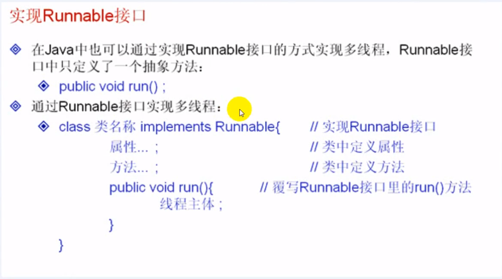
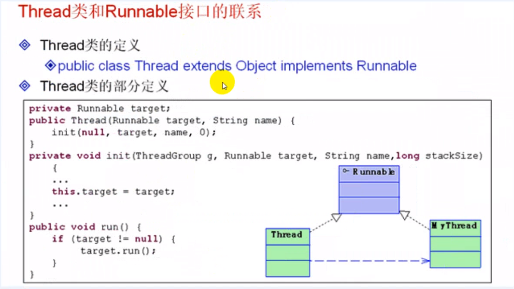
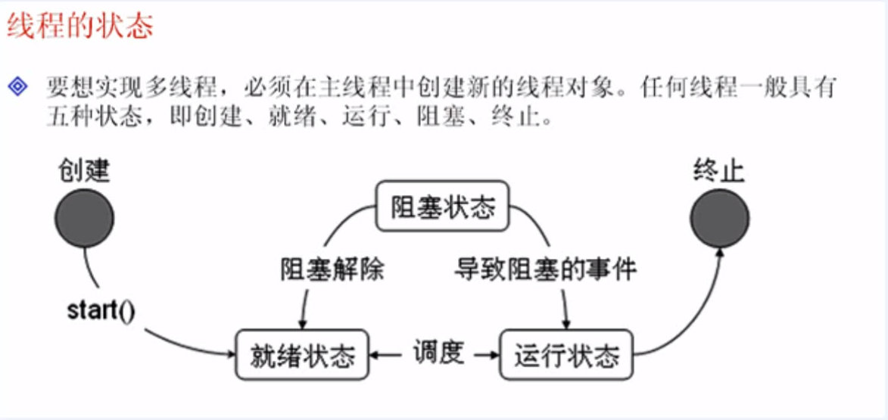
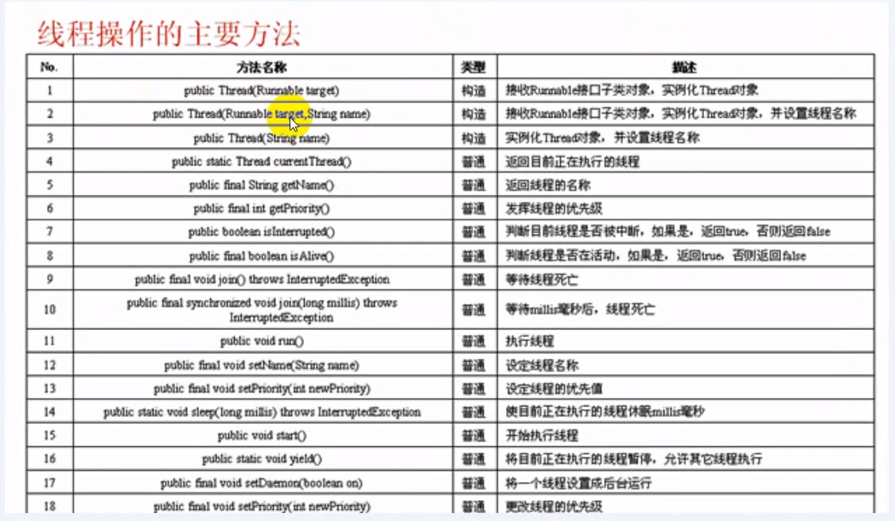
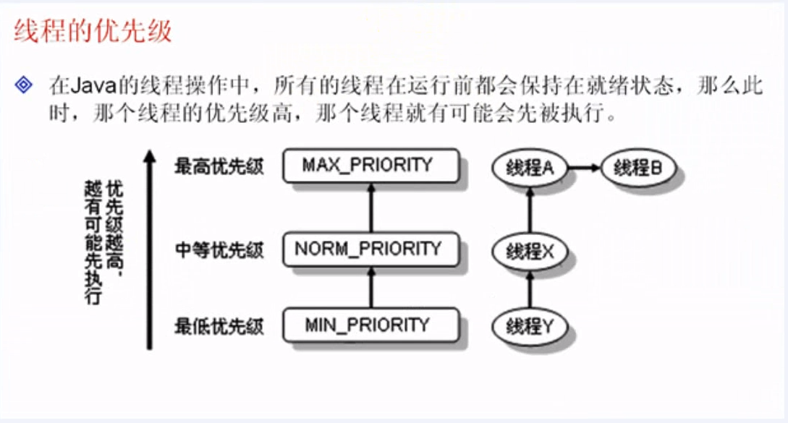

## 多线程

#### 1-1进程和线程


了解进程与线程的区别




线程实际上是在进程基础之上的进一步划分。

如果一个进程没有了，线程肯定会消失，那么如果线程消失，但是进程未必会消失。

所有的线程都是在进程的基础上并发（同时运行）


#### 1-2 java 线程的两种实现方式及区别

掌握 java 线程的两种实现方式及区别


#### 1-3Thread使用格式

**继承  `Thread` 类**

一个类继承 `Thread` 类之后，那么此类就具备了多线程的操作和功能。


了解线程的操作状态

**例子1、**

```java
/**
 * 如果想要启动一个线程必须使用 Thread 类中定义的start()
 */
class MyThread extends Thread{ // 继承 Thread类，作为线程的实现类
	private String name; // 表示线程名称
	public MyThread(String name) { // 通过构造方法配置name属性
		this.name = name;
	}
	
	public void run() { // 重写run方法作为线程的操作主体
		for(int i=0;i<10;i++) {
			System.out.println(this.name + "运行,i = " + i);
		}
	}
}

public class ThreadDemo01 {
	public static void main(String[] args) {
		MyThread mt1 = new MyThread("线程A"); // 实例化对象
		MyThread mt2 = new MyThread("线程B"); // 实例化对象
		
		mt1.run(); // 调用线程主体
		mt2.run(); // 调用线程主体
	}
}
//-------运行结果--------------
线程A运行,i = 0
线程A运行,i = 1
线程A运行,i = 2
线程A运行,i = 3
线程A运行,i = 4
线程A运行,i = 5
线程A运行,i = 6
线程A运行,i = 7
线程A运行,i = 8
线程A运行,i = 9
线程B运行,i = 0
线程B运行,i = 1
线程B运行,i = 2
线程B运行,i = 3
线程B运行,i = 4
线程B运行,i = 5
线程B运行,i = 6
线程B运行,i = 7
线程B运行,i = 8
线程B运行,i = 9
//-------运行结果--------------   
```


如果想要启动一个线程必须使用 Thread 类中定义的start()

**例子2、使用 start 方法**

程序的运行效果，哪个线程先抢占到CPU资源，哪个线程就执行。


一个线程的实例化对象只能执行一次吗，执行多次就报错。


```java
class MyThread extends Thread{ // 继承 Thread类，作为线程的实现类
	private String name; // 表示线程名称
	public MyThread(String name) { // 通过构造方法配置name属性
		this.name = name;
	}
	
	public void run() { // 重写run方法作为线程的操作主体
		for(int i=0;i<10;i++) {
			System.out.println(this.name + "运行,i = " + i);
		}
	}
}

public class ThreadDemo01 {
	public static void main(String[] args) {
		MyThread mt1 = new MyThread("线程A"); // 实例化对象
		MyThread mt2 = new MyThread("线程B"); // 实例化对象
		
		mt1.start(); // 调用线程主体
		mt2.start(); // 调用线程主体
	}
}

//---------------运行结果-----------------------
线程B运行,i = 0
线程A运行,i = 0
线程A运行,i = 1
线程A运行,i = 2
线程A运行,i = 3
线程A运行,i = 4
线程A运行,i = 5
线程B运行,i = 1
线程A运行,i = 6
线程A运行,i = 7
线程A运行,i = 8
线程A运行,i = 9
线程B运行,i = 2
线程B运行,i = 3
线程B运行,i = 4
线程B运行,i = 5
线程B运行,i = 6
线程B运行,i = 7
线程B运行,i = 8
线程B运行,i = 9
//---------------运行结果-----------------------
```


#### 1-4Thread代码实现


在JDK的src.zip中全部都是java的源程序代码，直接找到java.lang.Thread类，就可以打开Therad类的定义。

可以去src的lang源代码的Thread中查看 start的源码

native 关键字表示的是一个由 java代码调用的本地操作系统的方法的一个关键字。

在java中运行java程序调用本机的操作系统方法以完成特定的功能。


如果现在要是实现多线程的话，则肯定需要操作系统的支持，因为多线程中牵扯到一个抢占CPU的情况，要等待CPU进行调度，那么这一点肯定需要操作系统的底层支持，所以使用native调用本机的系统方法。


在各个操作系统中多线程的底层实现代码肯定是不同的，所以使用 `native` 关键字也可以让 `jvm` 自动调整不同的 `jvm` 实现。


#### 1-5Runnable接口





#### 1-6Runnable实现一个多线程

```java
/**
 * public Thread(Runnable target)
 *  就利用以上的构造方法，启动多线程
 */
class MyRunnable implements Runnable{ // 实现 Runnable 接口，作为线程的实现类
	private String name; // 表示线程名称
	public MyRunnable(String name) { // 通过构造方法配置name属性
		this.name = name;
	}
	
	public void run() { // 重写run方法作为线程的操作主体
		for(int i=0;i<10;i++) {
			System.out.println(this.name + "运行,i = " + i);
		}
	}

}

public class RunnableDemo01 {
	public static void main(String[] args) {
		MyRunnable mr1 = new MyRunnable("线程A"); // 实例化对象
		MyRunnable mr2 = new MyRunnable("线程B"); // 实例化对象
		Thread t1 = new Thread(mr1);
		Thread t2 = new Thread(mr2);
		t1.start();
		t2.start();
	}
}
```


#### 1-7 Thread 与 Runnable类的联系

`Thread` 类也是 `Runnable` 类的子类





使用 `Thread` 类在操作多线程的时候无法达到资源共享的目的，而使用 `Runnable` 接口实现了多线程操作，可以实现资源共享。


#### 1-8 Thread 与 Runnable接口使用结论

实现 `Runnable` 接口比继承 `Thread` 类有明显的优点：

1、适合多个相同程序代码的线程去处理同一个资源，可以避免由于单继承局限性所带来的的影响，增强了程序的健壮性，代码能够被多个线程共享、代码与数据是独立的。


**例子1、卖票**

没有实现资源共享

```java
class MyRunnable implements Runnable{ // 实现 Runnable 接口，作为线程的实现类
	private String name; // 表示线程名称
	private int ticket = 5;
	
	public MyRunnable(String name) { // 通过构造方法配置name属性
		this.name = name;
	}
	
	public void run() { // 重写run方法作为线程的操作主体
		for(int i=0;i<100;i++) {
			if(this.ticket > 0) {
				System.out.println(this.name +  "卖票：ticket = " + this.ticket--);
			}
		}
	}
}

public class RunnableDemo01 {
	public static void main(String[] args) {
		MyRunnable mr1 = new MyRunnable("线程A"); // 实例化对象
		MyRunnable mr2 = new MyRunnable("线程B"); // 实例化对象
		mr1.run();
		mr2.run();
	}
}

//-----------------运行结果------------------
线程A卖票：ticket = 5
线程A卖票：ticket = 4
线程A卖票：ticket = 3
线程A卖票：ticket = 2
线程A卖票：ticket = 1
线程B卖票：ticket = 5
线程B卖票：ticket = 4
线程B卖票：ticket = 3
线程B卖票：ticket = 2
线程B卖票：ticket = 1
//-----------------运行结果------------------
```


**例子2、卖票**

```java
class MyRunnable implements Runnable{ // 实现 Runnable 接口，作为线程的实现类
	private String name; // 表示线程名称
	private int ticket = 5;
	
	public MyRunnable(String name) { // 通过构造方法配置name属性
		this.name = name;
	}
	
	public void run() { // 重写run方法作为线程的操作主体
		for(int i=0;i<100;i++) {
			if(this.ticket > 0) {
				System.out.println(this.name +  "卖票：ticket = " + this.ticket--);
			}
		}
	}
}

public class RunnableDemo01 {
	public static void main(String[] args) {
		MyRunnable mr1 = new MyRunnable("线程A"); // 实例化对象
		new Thread(mr1).run();
		new Thread(mr1).run();
		new Thread(mr1).run();
	}
}
//--------------运行结果---------------------
线程A卖票：ticket = 5
线程A卖票：ticket = 4
线程A卖票：ticket = 3
线程A卖票：ticket = 2
线程A卖票：ticket = 1
//--------------运行结果---------------------   
```


#### 1-8线程的状态问题




创建状态：准备好了一个多线程对象

```java
Thread 对象 = new Thread();
```

就绪状态：调用了 `start()` 方法，等待 CPU 的调度

运行状态：执行 `run()` 方法

阻塞状态：暂时停止执行，可能将资源交给其他线程使用。

终止状态（死亡状态）：线程执行完毕，不再使用了。


#### 总结

1.进程与线程的区别，关系

​	线程是在进程的基础上划分的

​	线程消失了进程不会消失，进程如果消失了线程肯定会消失。

2.java实现进程的两种方式

​	继承 `Thread` 类

​	实现`Runnable`接口

3.线程的启动

​	通过`start()` 方法完成，需要进行 CPU 调度，调用`start()` 实际上调用的就是 `run()` 方法

4.`Thread`类也是`Runnable` 类的子类，使用了代理的机制完成

5.在使用多线程的实现中建议通过`Runnable` 接口实现，这样可以避免由于单继承带来的开发局限。而且通过`Runnable`接口也可以达到资源共享的目的。

6.线程的状态问题


## 多线程2


#### 2-1线程的主要方法




#### 2-2设置和获取线程名称

线程名称：

取了名字之后会有名字，不取名字系统会自动的赋一个


**例子**

````java
class MyThread implements Runnable{ // 实现 Runnable 接口
	
	public void run() { // 重写 run 方法
		for(int i=0;i<3;i++) {
			// 取得当前线程的名字
			System.out.println(Thread.currentThread().getName());
		}
	}
}

public class ThreadDemo01 {
	public static void main(String[] args) {
		MyThread mt = new MyThread(); // 实例化Runnable子类对象
		new Thread(mt).start(); // 系统自动设置线程名称
	
		new Thread(mt, "线程-A").start();; // 手动设置线程名称
		new Thread(mt, "线程-B").start();; // 手动设置线程名称
		new Thread(mt).start(); // 系统自动设置线程名称
		new Thread(mt).start(); // 系统自动设置线程名称
	}
}

//------------运行结果------------------------
Thread-0
Thread-0
Thread-0
线程-A
线程-A
线程-A
线程-B
线程-B
线程-B
Thread-2
Thread-2
Thread-2
Thread-1
Thread-1
Thread-1
//------------运行结果------------------------
````


**例2**

发现，程序中由主方法直接通过线程对象调用里面 `run` 方法。

```java
class MyThread implements Runnable{ // 实现 Runnable 接口
	
	public void run() { // 重写 run 方法
		for(int i=0;i<3;i++) {
			// 取得当前线程的名字
			System.out.println(Thread.currentThread().getName() + " i = " + i);
		}
	}
	
}

public class ThreadDemo01 {
	public static void main(String[] args) {
		MyThread mt = new MyThread(); // 实例化Runnable子类对象
		new Thread(mt).start(); // 系统自动设置线程名称
		mt.run();
	}
}

//---------------------运行结果-----------
main i = 0
Thread-0 i = 0
main i = 1
Thread-0 i = 1
Thread-0 i = 2
main i = 2
//---------------------运行结果-----------
```


#### 2-3判断线程是否存活

```java
class MyThread implements Runnable{ // 实现 Runnable 接口
	
	public void run() { // 重写 run 方法
		for(int i=0;i<3;i++) {
			// 取得当前线程的名字
			System.out.println(Thread.currentThread().getName() + " i = " + i);
		}
	}
	
}

public class ThreadDemo01 {
	public static void main(String[] args) {
		MyThread mt = new MyThread(); // 实例化对象

		Thread t1 = new Thread(mt, "线程"); // 系统自动设置线程名称
		System.out.println("线程开始执行之前" + t1.isAlive());
		t1.start(); // 启动线程
		System.out.println("线程开始执行之后" + t1.isAlive());
		
		for(int i=0;i<3000;i++) {
			System.out.println("main运行-->" + i);
		}
		
		// 以下输出结果不确定
		System.out.println("代码执行之后" + t1.isAlive());
	}
}
```


#### 2-4线程的强制运行

了解线程的强制运行，可以使用 `join`方法

```java
class MyThread implements Runnable{ // 实现 Runnable 接口
	
	public void run() { // 重写 run 方法
		for(int i=0;i<3;i++) {
			// 取得当前线程的名字
			System.out.println(Thread.currentThread().getName() + "运行    " + i);
		}
	}
}

public class ThreadDemo01 {
	public static void main(String[] args) {
		MyThread mt = new MyThread(); // 实例化Runnable子类对象
		Thread t =  new Thread(mt); // 系统自动设置线程名称
		t.start(); // 启动线程
		for(int i=0;i<50;i++) {
			if(i>10) {
				try {
					t.join(); // 线程强制运行
				}catch (InterruptedException e) {
					e.printStackTrace(); // 正常开发的时候用这个输出异常
				}
				System.out.println("Main线程运行----->" + i);
			}
		}
		System.out.println("代码执行之后，线程是否还存活" + t.isAlive());
	}
}
```


#### 2-5线程休眠

了解线程的休眠

线程的休眠可以直接调用 `Thread.sleep()` 实现

```java
class MyThread implements Runnable{ // 实现 Runnable 接口
	public void run() { // 重写 run 方法
		for(int i=0;i<50;i++) {
			if(i > 10) {
				try {
					Thread.sleep(500);// 线程休眠500ms
				}catch(InterruptedException e) {
					e.printStackTrace();
				}
			}
			// 取得当前线程的名字
			System.out.println(Thread.currentThread().getName() + "运行    " + i);
		}
	}
}

public class ThreadDemo01 {
	public static void main(String[] args) {
		MyThread mt = new MyThread(); // 实例化Runnable子类对象
		Thread t =  new Thread(mt); // 系统自动设置线程名称
		t.start(); // 启动线程
	}
}
```


#### 2-6线程中断

线程中断可以使用`interrupt`方法实现。

```java
class MyThread implements Runnable{ // 实现 Runnable 接口
	public void run() { // 重写 run 方法
		System.out.println("进入run方法");
		try {
			Thread.sleep(10000);// 线程休眠10s
			System.out.println("2已经完成了休眠");
		}catch (InterruptedException e) {
			e.printStackTrace();
			// TODO: handle exception
			System.out.println("3、休眠被终止");
		}
		System.out.println("4.run()方法正常结束");

	}
}

public class ThreadDemo01 {
	public static void main(String[] args) {
		MyThread mt = new MyThread(); // 实例化Runnable子类对象
		Thread t =  new Thread(mt); // 系统自动设置线程名称
		t.start(); // 启动线程
		try {
			Thread.sleep(2000); // 线程休眠
			t.interrupt(); // 中断线程程序执行
		} catch (Exception e) {
			// TODO: handle exception
		}
		
	}
}
```


#### 2-7设置后台进程

下面的可以在命令行编译，运行测试一下

```java
class MyThread implements Runnable{ // 实现 Runnable 接口
	public void run() { // 重写 run 方法
		System.out.println("进入run方法");
		while (true) {
			System.out.println(Thread.currentThread().getName() + "一直在运行");
		}
	}
}

public class ThreadDemo01 {
	public static void main(String[] args) {
		MyThread mt = new MyThread(); // 实例化Runnable子类对象
		Thread t =  new Thread(mt, "线程"); // 系统自动设置线程名称
		t.setDaemon(true); // 此线程在后台运行
		t.start(); // 启动线程
	}
}
```


#### 2-8线程的优先级





优先级只是有可能，并不是一定的

```java
class MyThread implements Runnable{ // 实现 Runnable 接口
	public void run() { // 重写 run 方法
		System.out.println("进入run方法");
		for (int i = 0; i < 5; i++) {
			try {
				Thread.sleep(3000);
			}catch (InterruptedException e) {
				// TODO: handle exception
				
			}
			System.out.println(Thread.currentThread().getName() + "  i = " + i);
		}
	}
}

public class ThreadDemo01 {
	public static void main(String[] args) {
		Thread t1 =  new Thread(new MyThread(), "线程A"); // 系统自动设置线程名称
		Thread t2 =  new Thread(new MyThread(), "线程B"); // 系统自动设置线程名称
		Thread t3 =  new Thread(new MyThread(), "线程C"); // 系统自动设置线程名称
		
		t1.setPriority(Thread.MIN_PRIORITY); // 设置最低的优先级
		t2.setPriority(Thread.MAX_PRIORITY); // 设置最高的优先级
		t3.setPriority(Thread.NORM_PRIORITY); // 设置普通的优先级
		
		t1.start();
		t2.start();
		t3.start();
	}
}
```


**查看优先级**

```java
class MyThread implements Runnable{ // 实现 Runnable 接口
	public void run() { // 重写 run 方法
		System.out.println("进入run方法");
		for (int i = 0; i < 5; i++) {
			try {
				Thread.sleep(3000);
			}catch (InterruptedException e) {
				// TODO: handle exception
				
			}
			System.out.println(Thread.currentThread().getName() + "  i = " + i);
		}
	}
}

public class ThreadDemo01 {
	public static void main(String[] args) {
		System.out.println("取得主方法的优先级" + Thread.currentThread().getPriority());
		System.out.println("最高优先级 = " + Thread.MAX_PRIORITY);
		System.out.println("默认优先级 = " + Thread.NORM_PRIORITY);
		System.out.println("最低优先级 = " + Thread.MIN_PRIORITY);
	}
}

//-----------运行结果----------------------
取得主方法的优先级5
最高优先级 = 10
默认优先级 = 5
最低优先级 = 1
//-----------运行结果----------------------
```


#### 2-9了解线程称的礼让

了解线程的礼让

```java
class MyThread implements Runnable{ // 实现 Runnable 接口
	public void run() { // 重写 run 方法
		System.out.println("进入run方法");
		try {
			Thread.sleep(500);
		}catch (InterruptedException e) {
			// TODO: handle exception
			e.printStackTrace();
		}
		for(int i=0;i<5;i++) {
			System.out.println(Thread.currentThread().getName() + " 线程在执行");
			if(i == 3) {
				System.out.println("线程  "+Thread.currentThread().getName()+"  礼让");
				Thread.currentThread().yield(); // 线程礼让
				
			}
		}
	}
}

public class ThreadDemo01 {
	public static void main(String[] args) {
		MyThread mt1 = new MyThread();
		Thread t1 = new Thread(mt1, "线程A");
		Thread t2 = new Thread(mt1, "线程B");
		
		t1.start();
		t2.start();
	}
}

```


#### 总结

对于这些操作方法，实际上都是从`Thread`类中找出的，用的时候只需要找出 `Thread` 类即可。


对于休眠操作最好记住，因为以后还要使用的。