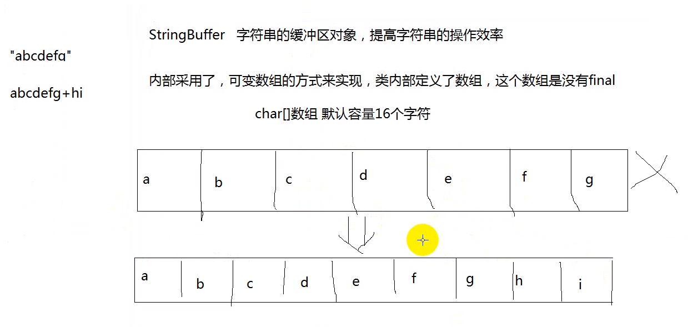

## StringBuffer类型

线程安全


#### 1-1出现的目的

**StringBuffer** 字符串的缓冲区对象，提高字符串的操作效率。

内部采用了可变数组的方式来实现，类内部定义了数组，这个数组是没有 `final` 修饰的。

```java
char[] 数组 默认容量16个字符
```





#### 1-2常用的自带方法


#### 1-3append

将任意类型的数据，添加缓冲区

`append`的返回值是`this`，调用者是谁，返回值就是谁。

```java
StringBuffer strbuf = new StringBuffer("");
// 调用StringBuffer方法append向缓冲区中追加内容
strbuf.append(6).append(false);
System.out.println(strbuf);
```


#### 1-4delete

删除缓冲区中字符，开始索引包含，结尾索引不包含

```java
delete(int start, int end);
```

```java
StringBuffer strbuf = new StringBuffer();
strbuf.append("abcdef");
strbuf.delete(1, 5);
System.out.println(strbuf);

//--------------运行结果-------------------
af
//--------------运行结果-------------------
```

如果要删除全部的

```java
strbuf.delete(0, strbuf.length());
```


#### 1-5insert

将任意类型的数据插入到缓冲区指定的索引上

```java
insert(int offest, 任意类型)
```


```java
StringBuffer strbuf = new StringBuffer();
strbuf.append("abcdef");
strbuf.insert(3, 10);
System.out.println(strbuf);
//--------------运行结果-------------------
abc10def
//--------------运行结果-------------------
```


```java
StringBuffer strbuf = new StringBuffer();
strbuf.append("abcdef");
strbuf.insert(6, 10);
System.out.println(strbuf);

// 这样不会错，会在最后一个插入
```


```java
StringBuffer strbuf = new StringBuffer();
strbuf.append("abcdef");
strbuf.insert(7, 10);
System.out.println(strbuf);

//--------------运行结果报错-----------------
数组越界
```


#### 1-6replace

将制定的索引范围内的所欲字符串，替换成新的字符串

包含开始，不包括结尾

```java
replace(int start, int end, String str)
```


```java
StringBuffer strbuf = new StringBuffer();
strbuf.append("abcdef");
strbuf.replace(1, 4, "zzz");
System.out.println(strbuf);

//----------运行结果----------------------
azzzef
```


#### 1-7reverse

将缓冲区的字符反转

```java
reverse()
```


```java
StringBuffer strbuf = new StringBuffer();
strbuf.append("abcdef");
strbuf.reverse();
System.out.println(strbuf);

//----------运行结果----------------------
fedcba
```


#### 1-8toString()

`toString`继承的 Object 重写的`toString`

将缓冲区中所有字符，变成字符串。


已经把数据类型改变了

```java
StringBuffer strbuf = new StringBuffer();
strbuf.append("abcdef");
strbuf.append(123456);

// 将可变的字符串缓冲区对象，变成了一个不可变的String对象
String str = strbuf.toString();
System.out.println(str);

//----------运行结果----------------------
abcdef123456
```


## StringBuilder

他的方法与`StringBuffer`的方法几乎是一样的，并不保证完全一样，但是方法都是一样的名字一样的作用。

它的速度比`StringBuffer`快，如果是单线程，优先使用这个

他是一个线程不安全的类


**例子**

```java
/**
	 * int[] arr = {34,12,89,68};将一个int[]中元素转换成字符串
	 * 格式[34,12,89,68]
	 * 
	 * 
	 * StringBuffer实现，节约内存空间资源， String + 在字符缓冲区， append方法
	 * 
	 */
public static String function_3() {
    int[] arr = {34,12,89,68};
    StringBuffer strbuf = new StringBuffer();
    strbuf.append(arr);

    for(int i=0;i<arr.length;i++) {
        if(i == arr.length - 1) {
            System.out.println("走进来了");

            strbuf.append(arr[i]).append("]");
        }else {
            strbuf.append(arr[i]).append(",");
        }
    }
    return strbuf.toString();
}
```


## 正则表达式

> 满足一定规则：可以表示是一个字符串表示规则


在正常的开发中，检查用户名是否合理

数字，字母，3-10


#### 1字符串方法与正则相关

与正则表达式相关的字符串的方法


实现正则规则和匹配，使用到字符串的方法

**matches**

```java
boolean matches(String 正则的规则); 匹配成功就返回true，否则就返回false
```


**split**

使用规则进行切割

```java
"abc".split("a"); // 使用规则进行切割
```


**replaceAll**

按照正则的规则来替换字符串

```java
String.replaceAll(正则的规则,  String str);
```


```reg
\\d 匹配数字
\\D 不是数字
```


#### 2-1小例子 检测是否是QQ号

```java
/*
 	检测QQ号码是否合法
	 	0不能开头、全数字、5-10位
	*/

String QQ = "1236";
boolean isQQ = QQ.matches("[1-9][0-9]{4,9}");
System.out.println(isQQ);
```

```java
QQ.matches("[1-9]\\d{4,9}");
\d 表示的是数字 0-9
```


#### 2-2检查手机号码是否合法

```java
String phone = "1308116605";
boolean isPhone = phone.matches("^1[34578][0-9]{9}");
System.out.println(isPhone);
```

```java
phone.matches("^1[34578][\d]{9}")
```


#### 2-3对字符串进行切割

```java
String string = "我是一个字符串";
String[] str1 = string.split("");
for(int i=0;i<str1.length;i++) {
    System.out.println(str1[i]);
}
```

```java
String string = 2019-12-13;
String[] str1 = string.split("-");
```

贪婪匹配

```java
String string = "2020   1  07";
String[] str1 = string.split(" +"); // +
for(int i=0;i<str1.length;i++) {
    System.out.println(str1[i]);
}
```


```java
切割ip地址
String string = "192.168.12.233";
String[] str1 = string.split("\\.");
```


#### 2-4对字符串进行替换

```java
/*
	"hello12345world6789012"; // 将所有的数字字符替换掉
*/
String string = "hello12345world6789012";
String str1 = string.replaceAll("\\d", "");
System.out.println(str1);
```


```java
String string = "hello12345world6789012";
String str1 = string.replaceAll("\\d+", "#");
System.out.println(str1);

// 或者
string.replaceAll("[\\d]+", "#");
```


#### 2-5匹配小数

```java
匹配小数
"\\d+\\.\\d+"
```


```java
匹配负数
"-\\d\\.\\d+"
```


```java
匹配保留两位小数的整数
"\\d+\\.\\d{1,3}"
```


