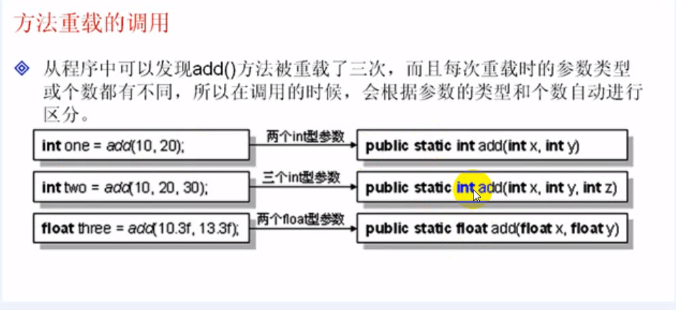

## 方法

掌握方法的作用，定义格式

掌握方法重载的概念及使用

方法的命名规则 ----> 驼峰命名法

可以使用return结束一个方法

掌握方法递归调用


**方法的重载**：方法的重载就是方法名称相同，参数的类型和参数的个数不同，通过传递参数的个数以及类型不同完成不同功能方法的调用。


#### 1-1方法的定义

> 方法就是一段可重复调用的代码段，例如：有某段长度约为100行的代码，要在多个地方使用此段代码，如果各个地方都重复编写此部分代码的话，则肯定会比较麻烦，而且此部分代码如果修改的话也比较困难，所以此时可以将此部分代码定义成一个方法，以供程序反复调用。


**方法的定义格式**

```java
public static 返回值类型 方法名称(类型 参数1，类型 参数2, ...){
    方法的主体
    程序语句；
    [return 表达式];
}

在这里定义的方法，因为其可以直接使用主方法（main()）调用，所以将方法声明处加上了public static两个关键字。
```


**例子1 尝试定义并使用一个方法**

```java
/**
 * 如果在返回值类型上写上void，则表示此方法没有返回值，就不能使用return返回内容。
 * 
 */
public class MethodDemo1 {
	public static void main(String[] args) {
		printInfo();// 调用printInfo()方法
		printInfo();// 调用printInfo()方法
		printInfo();// 调用printInfo()方法
		System.out.println("Hello world!!");
	}
	
	public static void printInfo() {
		char c[] = {'H', 'e', 'l', 'l', 'o'}; // 定义字符数组
		for(int i=0;i<c.length;i++) { // 循环输出
			System.out.print(c[i]);
		}
		System.out.println("");//换行
	}
}
```


**例子2 有返回值的方法**

```java
public class MethodDemo2 {
	public static void main(String[] args) {
		int x = 5;
		int y = 10;
		int result = addOne(x, y); // 调用整数的加法
		
		float result2 = addTwo(x, y);
		
		float result3 = addTwo(10.3f, 10.01f);
		
		
		System.out.println("结果为" + result);
		System.out.println("第二个返回结果为" + result2);
		System.out.println("第3个返回结果为" + result3);
	}
	
	// 定义方法，完成两个数组相加操作，方法返回一个int型的数据
	public static int addOne(int x, int y) {
		return x + y;
	}
	
	// 定义方法，完成两个数字的相加操作，方法返回一个float类型的数据
	public static float addTwo(float x, float y) {
		return x + y; // 方法中的参数是局部变量
	}
}
```


#### 1-2方法的重载

**方法的重载**：方法的重载就是方法名称相同，参数的类型和参数的个数不同，通过传递参数的个数以及类型不同完成不同功能方法的调用。

**注意事项：**方法的重载**一定只是在参数的类型或个数不同**。





**提示：System.out.println()方法也属于重载方法**

```java
public class MethodDemo4 {
	public static void main(String[] args) {
		System.out.println(3); // 输出整数
		System.out.println(33.3); // 输出浮点数
		System.out.println('3'); // 输出字符
		System.out.println(true); // 输出布尔值
		System.out.println(3 + 3); // 输出计算结果
	}
}
```


#### 1-3 return

可以使用return结束一个方法

return可以返回一个方法的结果，那么Java也可以使用return来结束一个方法

```java
public static void main(String[] args) {
	System.out.println("1、调用fun的方法之前：");
	fun(10);
	System.out.println("1、调用fun的方法之后：");
}

public static void fun(int x) {
	System.out.println("3、进入到fun方法");
	if(x == 10) {
		return; // 结束方法，返回调用处
	}
	System.out.println("4、正常执行完fun方法");
	
}
```


#### 1-4递归调用

> 递归调用是一种特殊的调用形式，是**方法自己调自己**。


求累加和可以使用for循环，这里使用递归实现以下。

```java
/**
 * 在递归操作中，一定要明确的写出方法的结束判断，否则会出现异常。
 */
public class MethodDemo6 {
	public static void main(String[] args) {
		int result = sum(100);
		System.out.println(result);
	}
	
	public static int sum(int num) { // 定义方法求和操作
		if(num == 1) { // 判断是否
			return 1;
		}else {
			return num + sum(num - 1); // 递归调用
		}
		
	}
}
```


#### 1-5总结

1、方法是指的是主方法调用的方法。

2、方法定义的时候如需要返回值，则明确写出返回值的类型。（就是Java的数据类型，基本数据类型和引用类型）如果不需要返回值，则直接写上void即可。

3、在方法中可以进行重载。

4、在方法中可以使用return来结束一个方法的操作。

5、方法自己调用自己，成为递归操作。递归操作中必须有明确的结束条件。


